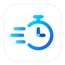

# ChronoCal

<p align="center">
  
</p>

<p align="center">
  <strong>Privacy-First Local Time Tracker for Google Calendar</strong><br />
  Track real time spent on meetings, focus blocks, and tasks directly inside Google Workspace without external servers, third-party databases, or browser-side timer loops.
</p>

<p align="center">
  
  
  
  
</p>

---

## What It Does

- ⏱ **Contextual Side-Panel Tracking**: Start, pause, resume, and stop tracking directly from any event in Google Calendar.
- 🔒 **100% Private & Native**: Runs entirely inside Google Apps Script (V8 runtime). Zero external servers, no third-party databases, and no user tracking.
- 🧭 **Built-In Onboarding Guide**: Friendly quick-start steps right on the side panel when no event is open.
- 📝 **Calendar Description Sync**: Automatically appends the tracked duration (e.g., `⌛ Duración Real: 01:45:00`) to the calendar event.
- ⏰ **Automatic End-Time Adjusting**: Optionally adjusts the event end time to reflect your actual worked duration.
- 📊 **Google Sheets Analytics**: One-click export to Google Sheets with automatic daily and per-event summary roll-ups.
- 🌐 **Full Multi-Language (i18n)**: Native dual-language support for Spanish (`es`) and English (`en`) with automatic locale detection and manual override.
- 🛡 **Drift-Proof Duration Math**: Calculates elapsed time using absolute timestamps (`Date.now() - started_at_ms + elapsed_ms`); immune to browser tab suspension, sleep mode, or system restarts.
- 🎨 **Google Material 3 Styling**: Visual button hierarchy with primary filled action buttons, precision chronometer detailing, and dual-color gradient branding.

---

## Repository Structure

```text
.
├── appsscript.json             # Google Workspace Add-on manifest (scopes, triggers, layout)
├── assets/                     # Production branding and store graphic assets
│   ├── icon.png                # 32x32 active companion icon (for appsscript.json)
│   ├── icon-32.png / .svg      # 32x32 companion sidebar icon
│   ├── icon-128.png / .svg     # 128x128 Google Workspace Marketplace store icon
│   ├── icon-512.png            # 512x512 high-resolution master asset
│   └── promo-card-440x280.png  # 440x280 Marketplace store listing promo banner
├── docs/                       # Architecture, legal, and publishing documentation
│   ├── CLASP_SETUP.md          # clasp development and deployment walkthrough
│   ├── MARKETPLACE_PUBLISHING.md # Google Cloud setup, OAuth verification & store listing
│   ├── PRIVACY.md              # Public Privacy Policy (Google Limited Use compliant)
│   ├── TERMS.md                # Terms of Service & MIT Open Source license
│   ├── README.md               # Documentation index
│   └── prd/                    # Product Requirements Document (PRD v1.1)
├── scripts/
│   ├── check-syntax.js         # Offline V8 syntax and manifest validator
│   └── generate-branding.js    # Deterministic vector and PNG asset generator
├── src/                        # Google Apps Script source files
│   ├── calendar.gs             # Calendar API, recurrence parsing, end-time & description patch
│   ├── cards.gs                # CardService UI builders, onboarding, button hierarchy, settings
│   ├── config.gs               # Runtime constants, default settings, cache limits
│   ├── i18n.gs                 # Internationalization bundles (es/en) and formatters
│   ├── main.gs                 # Action handlers, navigation, event-open triggers
│   ├── session.gs              # Session state, duration math, UserProperties storage
│   └── sheets.gs               # Google Sheets export engine and summary roll-up aggregator
└── tests/                      # Pure offline unit test suite (runs in Node.js VM with stubs)
    ├── calendar.test.js        # ID parsing, recurrence candidate resolution tests
    ├── cards.test.js           # UI builders, button styling, onboarding card tests
    ├── handlers.test.js        # Action handler, session switching, settings navigation tests
    ├── i18n.test.js            # Translation interpolation and fallback tests
    ├── session.test.js         # Duration math, state transitions, cache eviction tests
    ├── settings.test.js        # Configuration normalization and toggle tests
    └── sheets.test.js          # Export row generation and summary sheet tests
```

---

## Quick Start

### Prerequisites
- [Node.js](https://nodejs.org/) (>= 18) and npm
- A Google account with access to Google Calendar and Google Apps Script
- Optional: `direnv` or `nix` (environment shell configuration included)

### 1. Development Environment
```bash
direnv allow
npx @google/clasp login
```

### 2. Create or Link Your Apps Script Project
```bash
# Create a new standalone Apps Script project
npx @google/clasp create --type standalone --title "ChronoCal" --rootDir .

# Push code to Google
npm run push

# Open in browser editor
npm run open
```

---

## Automated Test Suite

ChronoCal features a comprehensive offline unit test suite with zero external network dependencies or Google authentication requirements:

```bash
# Run all 66 automated tests
npm test

# Check V8 syntax and manifest structure
npm run lint

# Run both before pushing or opening a PR
npm test && npm run lint
```

---

## Asset & Branding Pipeline

To rebuild all vector SVGs and pixel-perfect PNGs for the companion bar, store icon, and promo banner:

```bash
npm run build:assets
```

Asset outputs conform to Google Workspace Marketplace publishing specifications.

---

## Testing in Google Calendar (Developer Mode)

1. Run `npm run push` to upload local code to Apps Script.
2. Open [Google Calendar](https://calendar.google.com/) in your browser on desktop.
3. Click the **Gear icon (⚙)** in the top right -> **Settings**.
4. In the left navigation, click **Add-ons**.
5. Check **Enable developer add-ons execution**.
6. The head deployment (`@HEAD`) will appear on the right companion sidebar.
7. Click the ChronoCal icon to open the panel, or select any event on your calendar.

---

## Documentation Directory

- [**Documentation Index**](docs/README.md)
- [**Product Requirements Document (PRD)**](docs/prd/README.md)
- [**CLASP Setup & Deployment Guide**](docs/CLASP_SETUP.md)
- [**Marketplace Publishing Guide**](docs/MARKETPLACE_PUBLISHING.md)
- [**Privacy Policy**](docs/PRIVACY.md)
- [**Terms of Service**](docs/TERMS.md)
- [**Contributing Guidelines**](CONTRIBUTING.md)

---

## License

ChronoCal is open-source software licensed under the [MIT License](LICENSE).
